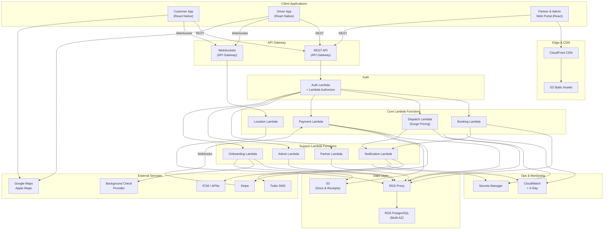

# Valet Platform — Architecture Diagram

Generated by Zalcro. This diagram maps the full system architecture for a three-sided valet marketplace — customer, driver, and garage partner — built on a serverless AWS stack.

